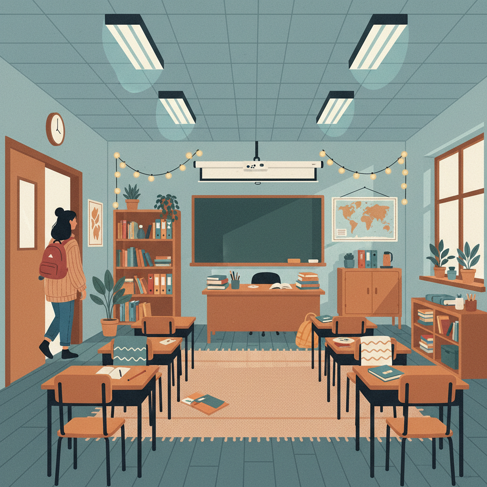
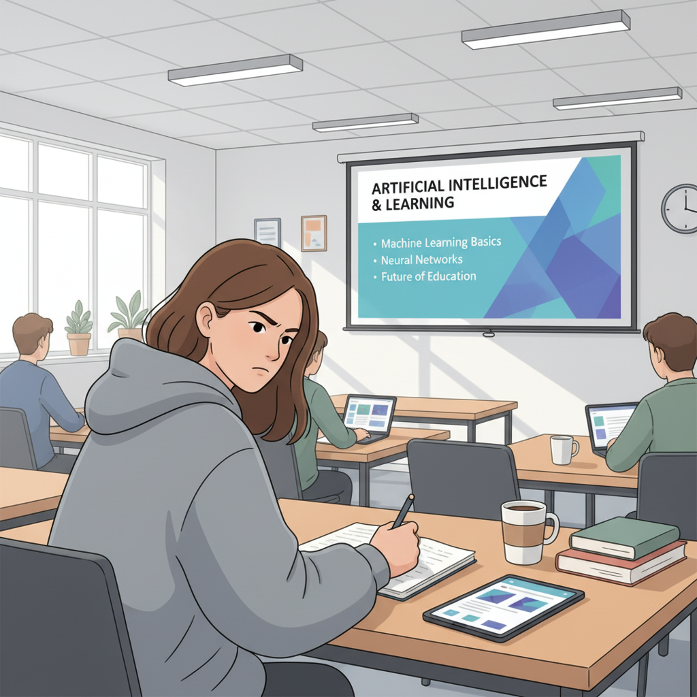
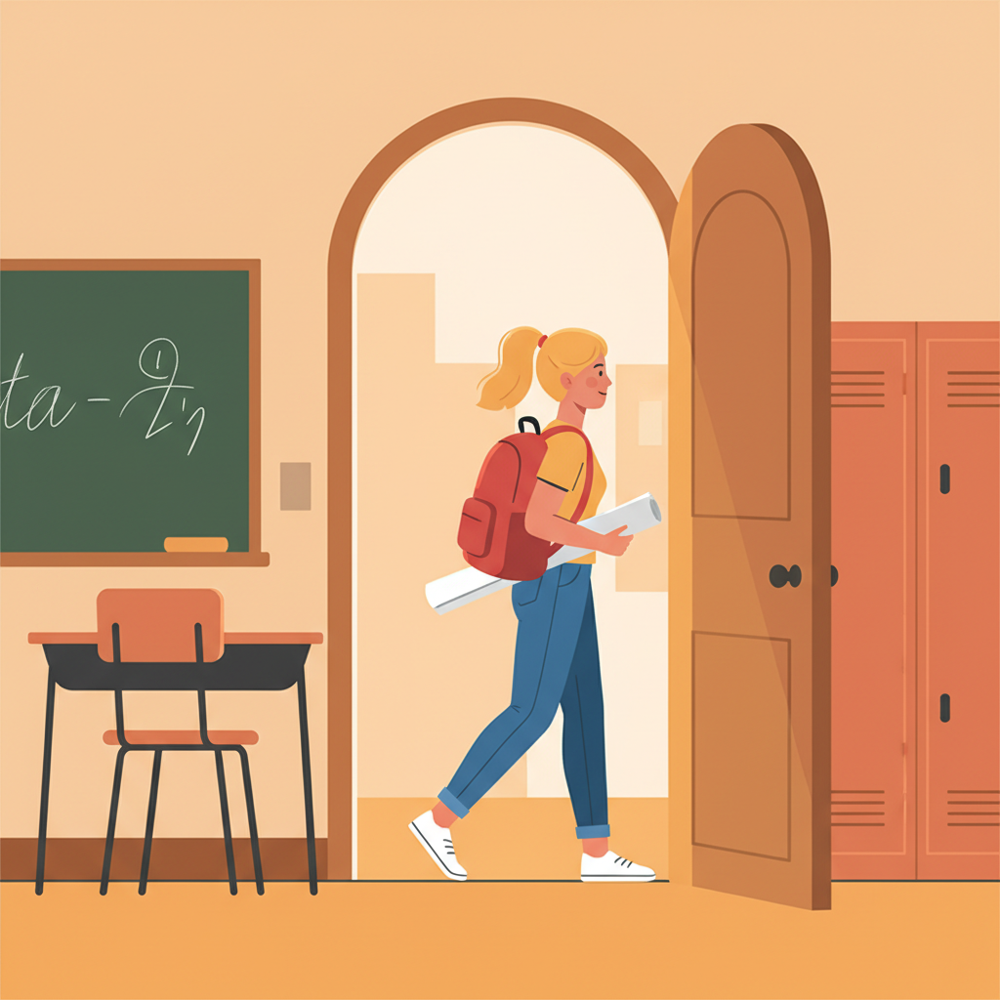
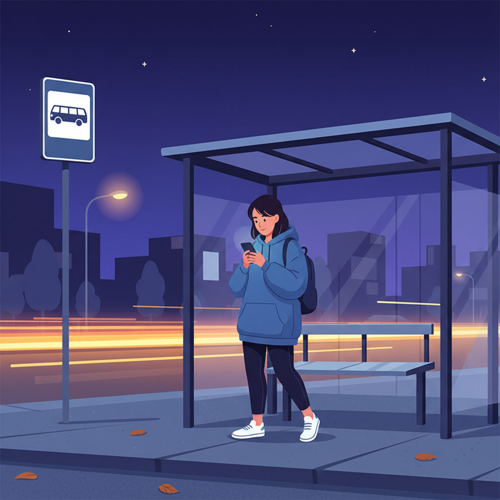
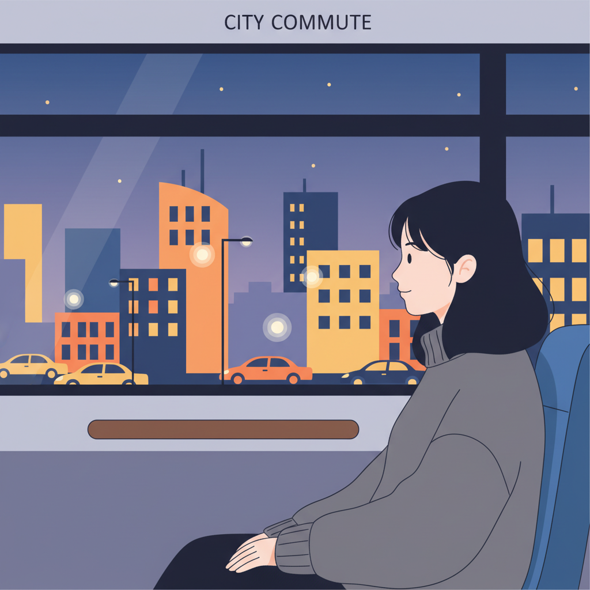

# 영화 대본: 차가운 교실

**장르:** 일상 드라마  
**작성일:** 2026-05-30

---

## S#1. 교실 내부 — 낮

> 형광등 불빛이 차갑게 내려앉은 교실.  
> 에어컨 바람인지, 건물 특유의 냉기인지 모를 한기가 감돈다.

**수경**, 가방을 들고 교실 문을 열고 들어선다.  
문 틈으로 복도의 따뜻한 공기가 잠시 스쳐 지나간다.

수경이 자리에 앉는다. 팔뚝에 소름이 돋는다.  
그녀는 팔짱을 끼고 어깨를 살짝 움츠린다.

**수경** *(속으로)*  
> "좀 춥네…"

칠판 앞, **강사**가 노트북을 펼치며 수업을 시작한다.

**강사**  
> "자, 오늘 AI 공장장 수업 시작하겠습니다."

수경은 추위를 잊으려는 듯 노트에 집중한다.  
그러나 이내 다시 팔을 문지른다.

**수경** *(속으로)*  
> "다음엔 점퍼 꼭 챙겨와야지."

---

## S#2. 교실 내부 — 수업 중

수업이 이어진다. 화면엔 AI 관련 슬라이드가 흘러간다.  
수경의 손이 바쁘게 움직인다. 필기, 클릭, 필기.

차가운 공기 속에서도 눈빛만은 또렷하다.

---

## S#3. 교실 내부 — 수업 후

수경이 가방을 챙기며 자리에서 일어선다.  
그녀는 출입구 쪽을 바라보며 혼잣말을 한다.

**수경**  
> "다음엔 점퍼 가져와야겠다."

교실 문이 열리고, 복도의 따뜻한 공기가 다시 한번 그녀를 감싼다.

**수경**, 문밖으로 걸어 나간다.

---

## S#4. 건물 밖 — 저녁

교실을 나선 **수경**, 건물 출입구를 빠져나온다.  
바깥 공기가 교실보다 따뜻하게 느껴진다.

그녀는 가방 끈을 고쳐 메고 발걸음을 옮긴다.

버스 정류장. 수경이 핸드폰을 꺼내 시간을 확인한다.  
잠시 후 버스가 도착하고, 그녀는 올라탄다.

---

## S#5. 버스 안 — 저녁

창가 자리에 앉은 **수경**.  
차창 밖으로 도시의 불빛이 흘러간다.

그녀는 오늘 필기한 노트를 잠깐 펼쳐보다 덮는다.

**수경** *(속으로)*  
> "오늘도 열심히 했다. 다음엔 점퍼 꼭 챙기자."

버스가 정류장에 멈추고, 수경이 자리에서 일어선다.

---

## S#6. 집 앞 — 밤

현관문 앞에 선 **수경**.  
가방에서 열쇠를 꺼내 문을 연다.

따뜻한 집 안의 공기가 그녀를 맞이한다.  
수경, 작게 한숨을 내쉬며 미소 짓는다.

문이 닫힌다.

---

*— FIN —*
