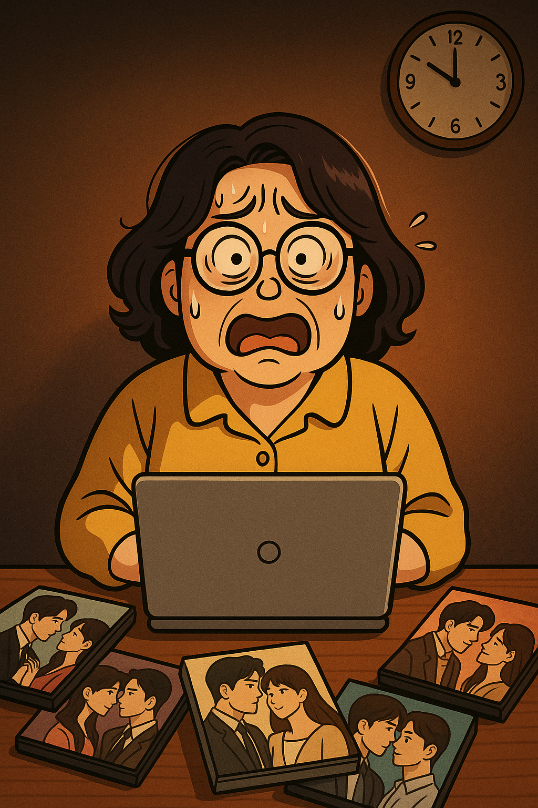
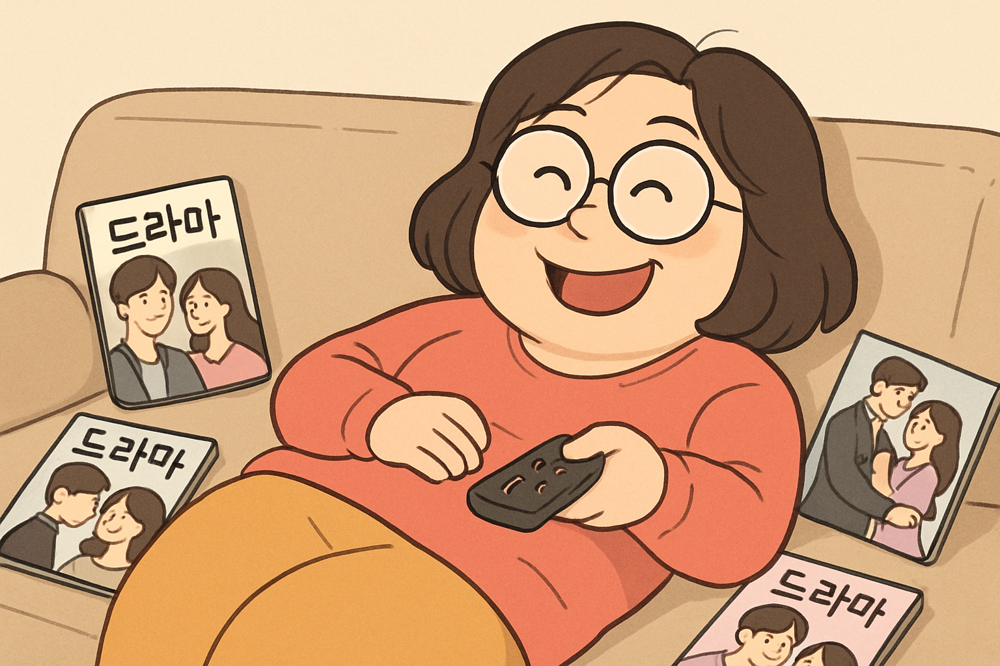
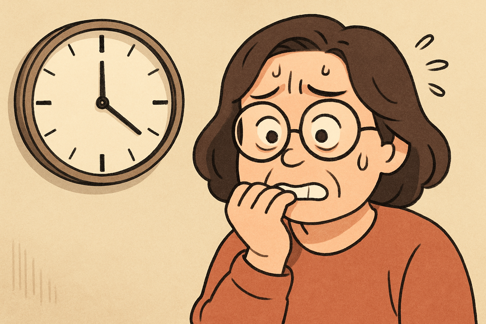
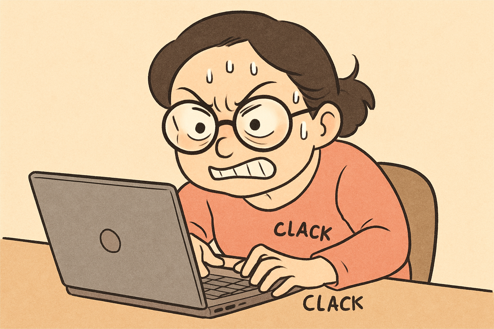
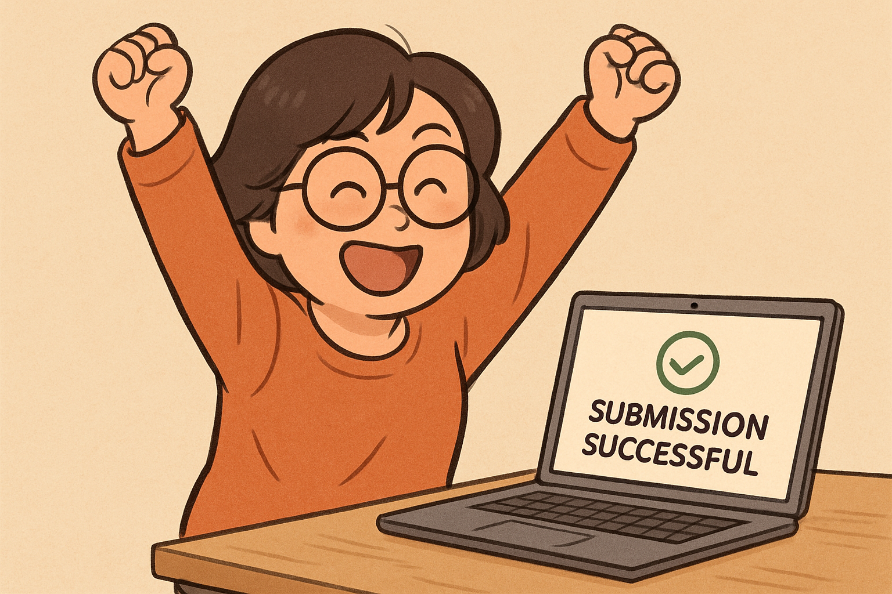

# 아줌마의 숙제 대작전

**장르:** 일상·코믹 / **원작:** 처음으로 ai agent수업을 들었다. 선생님이 숙제를 내줬는데 미루고 미뤘다. 숙제 제출기한이 1시간 밖에 안남았다. 과연 나이가 많은 이 아줌마는 숙제를 마칠수 있을까? 집에와서 드라마만 계속 보다가 마감 1시간전에 노트북 앞에 앉아있다. 두꺼운 안경을 쓰고서...

## Scene 1: 세상의 모든 드라마는 나의 것!

수경은 소파에 폭신하게 자리를 잡고 앉아, 리모컨을 손에 쥐고 있었다. 드라마의 플롯에 몰입하여 시간 가는 줄 모르고 있었다. "이게 바로 내 삶이지. 드라마처럼 흥미진진하게 살 수 있다면!" 그녀의 두꺼운 안경 너머로 빛나는 눈동자에 호기심이 가득했다. 

## Scene 2: 마감이라는 괴물

문득 시계가 눈에 들어왔다. "어머나, 벌써!" 시간은 어째서 그렇게 빨리 지나가는 것인지, 마감이라는 괴물이 그녀에게 다가오고 있었다. "1시간. 60분의 기적을 보여줄 시간이다." 수경은 급히 일어나 거실을 가로질러 노트북 앞으로 달려갔다.

## Scene 3: 두꺼운 안경과의 전쟁

두꺼운 안경을 다시 코에 올리고 노트북을 열었다. "자, 수경. 할 수 있다면 할 수 있어!" 스스로에게 주문을 걸며, 그녀는 키보드를 두드리기 시작했다. 마치 전투에 임하는 장군처럼 그녀의 손가락은 키보드를 빛의 속도로 달렸다. 

## Scene 4: 59분의 승리

59분이 흘렀고, 수경은 마지막 문장을 입력하며 제출 버튼을 눌렀다. 노트북 화면에 '제출 완료'라는 메시지가 나타났다. "됐어!" 내심 안도의 한숨을 쉬며, 그녀는 두 손을 번쩍 들어 올렸다. 

수경은 남은 시간을 돌아보며 생각했다. '다음엔 드라마를 조금 덜 보던지, 아니면 숙제를 미리 하던지 해야겠다.' 누구나 할 수 있는 의례적인 다짐이었지만, 그 순간만큼은 진지했다. 

그리고 그제서야, 이제는 드라마보다 더 드라마틱한 숙제 대작전이 끝났다는 사실을 깨달았다. 

마감이라는 괴물은 다음 주에도 찾아올 테지만, 그때는 또 다른 모험이 기다릴 것이다.

---

*원작 일기: 26-06-12.md · 변환: 2026-06-12 · 일상·코믹 K-드라마*
