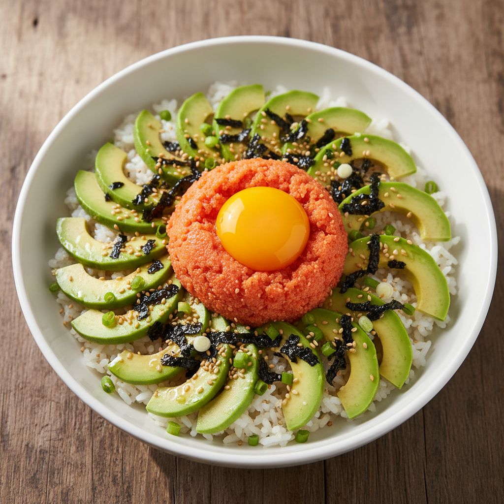

# 명란아보카도비빔밥

## 기본 정보
- **조리 시간**: 20분
- **분량**: 4인분
- **난이도**: 쉬움

---

## 재료

### 메인
- 밥 4공기 (800g)
- 명란젓 4~6줄
- 아보카도 2개

### 양념
- 참기름 4큰술
- 간장 4작은술
- 참깨 약간
- 김 (구운 김 또는 김가루) 적당량

### 선택 재료
- 달걀 노른자 4개
- 쪽파 약간
- 고추냉이(와사비) 소량

---

## 만드는 법

1. **밥 준비**: 따뜻한 밥을 그릇에 담는다.
2. **아보카도 손질**: 아보카도를 반으로 갈라 씨를 제거하고, 껍질을 벗긴 후 먹기 좋은 크기로 썬다.
3. **명란 준비**: 명란젓의 껍질을 칼로 살살 긁어 알만 발라낸다.
4. **비빔밥 구성**: 밥 위에 아보카도, 명란, 달걀 노른자(선택)를 올린다.
5. **양념 추가**: 참기름, 간장을 둘러준다.
6. **마무리**: 참깨, 김가루, 쪽파를 올려 완성한다.
7. **비비기**: 먹기 직전에 골고루 비벼서 즐긴다.

---

## 팁

- 명란의 짠맛이 강하면 간장은 생략해도 좋다.
- 아보카도는 완숙된 것을 사용해야 부드럽고 고소하다.
- 와사비를 조금 넣으면 풍미가 더욱 깊어진다.
- 밥이 뜨거울수록 명란과 잘 어우러진다.
