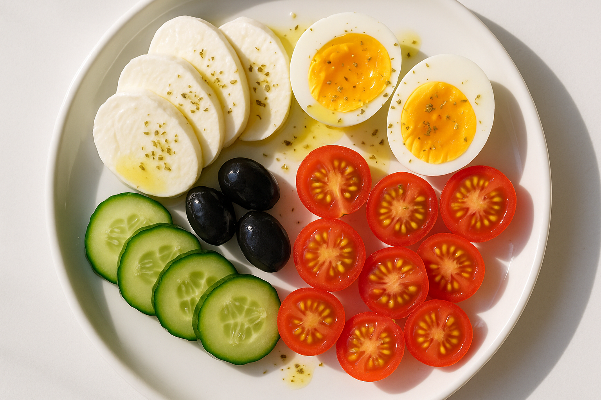

# 🌅 아침 — 모짜렐라 그릭 플레이트 (4인분)

지중해식 고단백 아침. 불은 달걀 삶는 것뿐이고 10분이면 차려집니다.

> 💡 원래는 '페타치즈'를 쓰지만, 구하기 쉽고 순한 **프레시 모짜렐라**로 대체했어요.
> 더 저렴·고단백으로 가려면 모짜렐라 대신 **참치캔 2캔**(기름 빼고)을 올려도 좋습니다.

## 재료 (4인분)
- 달걀 8개 (삶기)
- 프레시 모짜렐라 200~250g (한입 크기로) — 또는 참치캔 2캔
- 오이 2개
- 방울토마토 25~30개 (약 1팩)
- 올리브유 3~4큰술
- 레몬즙 1큰술 (없으면 식초 약간)
- 소금·후추, 말린 오레가노(또는 바질) 약간

## 만들기
1. 달걀은 끓는 물에 10분 삶아 찬물에 식힌 뒤 반으로 자릅니다.
2. 오이는 한입 크기로, 방울토마토는 반으로 자릅니다.
3. 큰 접시에 채소·모짜렐라·달걀을 보기 좋게 담습니다.
4. 올리브유 + 레몬즙 + 소금·후추 + 오레가노를 뿌려 마무리.

## 포인트
- 모짜렐라는 순하니 소금·후추로 간을 맞추세요.
- 더 든든하게: 통곡물 빵이나 크래커를 곁들이세요.

## 장보기
- 달걀, 프레시 모짜렐라 200~250g(또는 참치캔 2캔), 오이 2개, 방울토마토 1팩, 올리브유, 레몬

> **영양 대략(1인분)** — 단백질 ~22g / 탄수화물 ~8g / 당 ~5g

*작성: 2026-06-12 · 여름 불 적게 쓰는 아침 (4인분)*
