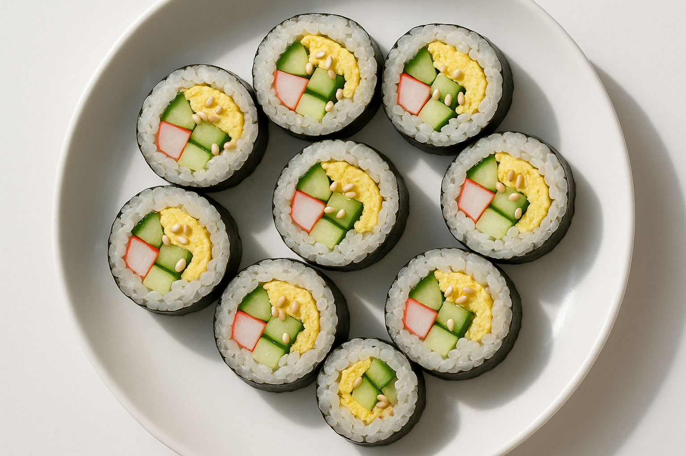

# 🌙 저녁 — 달걀·오이·크래미 김밥 (4인분 · 약 8줄)

담백하고 부담 없는 김밥. 불은 달걀 지단 부치는 것뿐이라 여름 저녁에 딱.

## 재료 (4인분 · 약 8줄)
- 김밥김 8장
- 밥 5~6공기 (한 김 식혀서)
- 달걀 6개
- 오이 2개
- 크래미(맛살) 16~20개
- 참기름 2큰술, 소금 약간, 통깨

**밥 양념**
- 참기름 2작은술 + 소금 약간 (밥에 살살 비벼두기)

## 만들기
1. **밑준비**
   - 오이는 길게 채 썰어 소금에 5분 절인 뒤 물기를 꼭 짭니다 (아삭함 유지).
   - 크래미는 결대로 가늘게 찢습니다.
2. **달걀 지단**
   - 달걀을 소금 약간 넣고 풀어, 팬에 얇게 부쳐 길게 썹니다. (약불, 기름 살짝)
3. **밥 양념**
   - 따뜻한 밥에 참기름·소금·통깨를 넣고 가볍게 섞습니다.
4. **말기**
   - 김 위에 밥을 80%만 얇게 펴고, 달걀·오이·크래미를 가지런히 올려 단단히 맙니다.
5. 김밥 겉에 참기름을 살짝 바르고 통깨를 뿌린 뒤, 칼에 물을 묻혀 한입 크기로 썹니다.

## 포인트
- 밥을 너무 두껍게 깔지 않아야 담백하고 잘 말려요.
- 저당·가벼움: 밥을 살짝 줄이고 오이·크래미를 넉넉히.
- 마요를 좋아하면 크래미를 마요에 살짝 버무려 넣어도 맛있어요.

## 장보기
- 김밥김 8장, 밥(쌀), 달걀 6개, 오이 2개, 크래미 1봉, 참기름, 통깨

> **영양 대략(1인분)** — 단백질 ~17g / 탄수화물 ~55g

*작성: 2026-06-12 · 여름 불 적게 쓰는 저녁 (4인분)*
