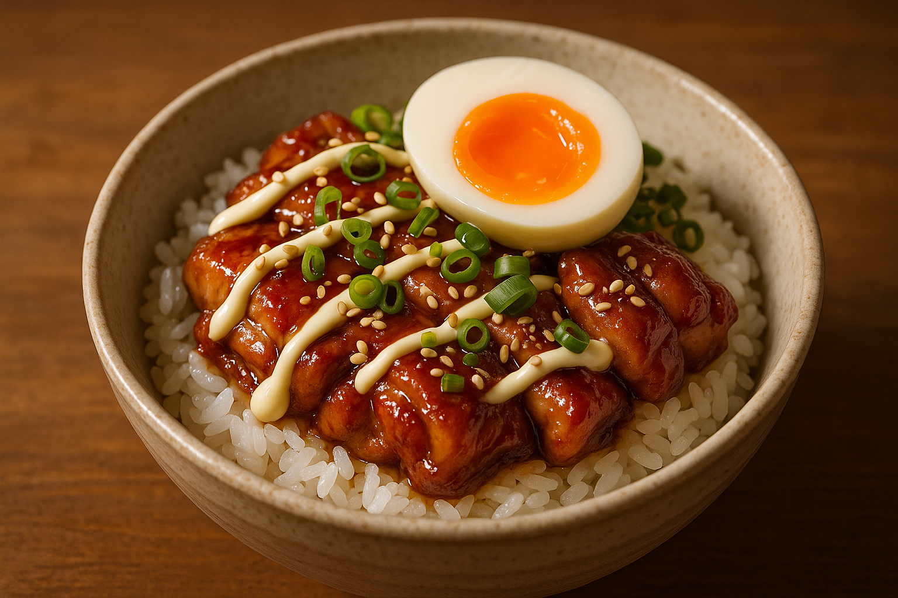

# ☀️ 점심 — 데리야끼 치킨 마요 덮밥 (4인분 · 저당)

탄수화물 OK. 고등학생 아들도 좋아할 든든하고 달짝지근한 한 그릇.
**저당 고정 버전** — 설탕·올리고당 대신 혈당을 거의 안 올리는 **알룰로스**를 씁니다.

## 재료 (4인분)
- 닭다리살(또는 닭허벅지살) 800g
- 밥 4공기
- 마요네즈 4큰술 (라이트 마요 추천)
- 쪽파 또는 대파, 통깨 약간
- (선택) 달걀 4개 — 반숙 후라이 토핑

**데리야끼 소스 (저당)**
- 간장 6큰술
- 맛술(미림) 4큰술
- 물 8큰술
- **알룰로스 3큰술** (저당 고정 — 칼로리·혈당 거의 0)

## 만들기
1. 닭다리살은 한입 크기로 자르고 소금·후추로 밑간합니다.
2. 팬을 달궈 기름 살짝 두르고 닭을 껍질 쪽부터 노릇하게 굽습니다 (약 8~10분). 양이 많으면 두 번에 나눠 구우세요.
3. 데리야끼 소스 재료를 붓고 중불에서 졸여 닭에 윤기 나게 입힙니다.
   - 알룰로스는 설탕보다 단맛이 약하니, 간을 보며 1큰술씩 더해도 좋아요.
4. 밥 위에 닭을 올리고 마요네즈를 지그재그로, 쪽파·통깨를 뿌립니다.
5. 반숙 후라이를 올리면 더 맛있어요.

## 포인트
- **저당 핵심**: 알룰로스는 졸일 때 설탕처럼 윤기는 덜 나지만 당류는 거의 없습니다.
- 더 가볍게: 라이트 마요를 쓰고 밥 양을 줄이세요.
- 시원하게: 같은 소스로 구운 닭을 식혀 **콜드 치킨 덮밥**으로 즐겨도 좋아요.

## 장보기
- 닭다리살 800g, 밥(쌀), 마요네즈, 간장, 맛술, **알룰로스**, 쪽파, 통깨, (달걀 4개)

> **영양 대략(1인분)** — 단백질 ~33g / 탄수화물 ~58g (저당 소스로 당류 최소화)

*작성: 2026-06-12 · 여름 불 적게 쓰는 점심 (4인분 · 저당)*
