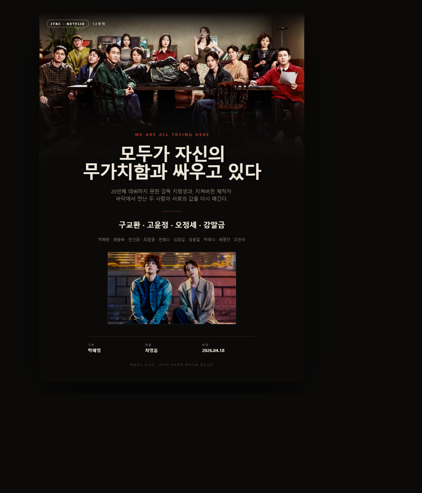

# 모두가 자신의 무가치함과 싸우고 있다

> *We Are All Trying Here* (2026) · JTBC 토일 드라마 / 넷플릭스 동시 공개

---

## 1. 기본 정보

| 항목 | 내용 |
|---|---|
| 제목 | 모두가 자신의 무가치함과 싸우고 있다 |
| 영제 | We Are All Trying Here |
| 채널 | JTBC 토일 드라마 (넷플릭스 동시 공개) |
| 방영 기간 | 2026년 4월 18일 ~ 2026년 5월 24일 |
| 방송 시간 | 토 22:40 / 일 22:30, 회당 약 90분 |
| 회차 | 총 12부작 |
| 장르 | 휴먼 드라마 (영화계 배경 · 성장 · 치유) |
| 극본 | 박해영 |
| 연출 | 차영훈 |
| 기획 | SLL |
| 제작사 | 스튜디오 피닉스, SLL, 스튜디오 플로우 |
| 프로듀서 | 배수정 |
| 음악감독 | 개미 |
| 평점 | TMDB 기준 매우 높음(99%) |

---

## 2. 기획 의도

> "잘난 친구들 사이에서 혼자만 안 풀려, 시기와 질투로 괴로워 미쳐버린 인간의 **평화 찾기**를 따라가는 드라마."

제목 그대로, 이 작품의 전제는 "무가치함은 실패한 사람만의 것이 아니다"이다.
잘나가 보이는 인물도, 바닥에 있는 인물도 각자 자기 자신의 쓸모없음과 싸우고 있다는 시선으로
영화판이라는 좁고 잔인한 세계를 빌려 우울·질투·불안·회복을 정면으로 다룬다.

---

## 3. 줄거리

20년째 데뷔하지 못한 영화감독 지망생 **황동만**. 같은 출발선에 섰던 '8인회' 친구들은
어느새 감독으로, 대표로, 배우로 자리를 잡았지만 그만 여전히 준비생이다.
시기와 질투로 스스로를 갉아먹으며 바닥까지 내려간 그 앞에,
현장에 지칠 대로 지친 영화사 기획PD **변은아**가 나타난다.

서로의 밑바닥을 본 두 사람이 상대의 값을 다시 매겨주면서,
동만은 자기 무가치함의 끝에서 마침내 자기 이야기를 건져 올리기 시작한다.

---

## 4. 등장인물

### 주요 인물

| 배우 | 배역 | 설정 |
|---|---|---|
| 구교환 | **황동만** | 주인공. '8인회' 멤버. 20년째 영화감독 데뷔를 준비 중인 지망생 |
| 고윤정 | **변은아** | 주인공. 영화사 '최필름' 소속 기획PD. 현장에 지쳐 있다 |
| 오정세 | **박경세** | '8인회' 멤버. 영화사 '고박필름' 소속 감독 |
| 강말금 | **고혜진** | '8인회' 멤버. 영화사 '고박필름' 대표 |

### 주변 인물

| 배우 | 배역 | 설정 |
|---|---|---|
| 박해준 | 황진만 | 동만의 형. 현재는 용접공 |
| 배종옥 | 오정희 | 국민배우 |
| 한선화 | 장미란 | 배우 |
| 최원영 | 최동현 | 영화사 '최필름' 대표 |
| 전배수 | 박영수 | — |
| 심희섭 | 이준환 | — |
| 박예니 | 최효진 | — |
| 배명진 | 이기리 | — |
| 조민국 | 우승태 | — |
| 연운경 | 가수자 | — |
| 김종훈 | 마재영 | — |
| 성동일 | 노강식 | 특별출연 |

> 특별출연으로 성동일, 김동욱이 참여했다.

인물별 프로필 이미지는 `cast/` 폴더 참고 (`01_구교환_황동만.jpg` 형식).

---

## 5. 감상 포인트

- **박해영 작가의 언어** — 〈나의 아저씨〉, 〈나의 해방일지〉를 쓴 작가. 인물의 밑바닥 감정을 대사 한 줄로 꿰뚫는 화법이 이 작품에서도 그대로 이어진다.
- **'8인회'라는 장치** — 같은 곳에서 출발했지만 다르게 도착한 친구들. 비교와 질투라는 가장 보편적인 감정을 영화판으로 확대해 보여준다.
- **무가치함의 민주성** — 성공한 인물도 예외가 아니다. 제목의 '모두가'는 수사가 아니라 구조다.
- **회복의 방식** — 위로가 아니라, 서로의 값을 다시 매겨주는 관계를 통해 회복한다.

---

## 6. 자료

- 스틸컷 27장: `stills/still_01.jpg` ~ `still_27.jpg` (원본 해상도, 최대 3840×2160)
  - `still_08.jpg` — 등장인물 전원 앙상블 컷 (메인 비주얼)
  - `still_01.jpg` — 황동만·변은아 투샷
- 배우 프로필 16장: `cast/`
- 팬메이드 포스터: `poster.html`, `poster.png`

## 7. 출처

- 넷플릭스 작품 페이지 — https://www.netflix.com/title/82189639
- 위키백과 — https://ko.wikipedia.org/wiki/모두가_자신의_무가치함과_싸우고_있다
- 나무위키 — https://namu.wiki/w/모두가%20자신의%20무가치함과%20싸우고%20있다
- TMDB (출연진·이미지) — https://www.themoviedb.org/tv/289424

> 이미지 저작권은 제작사·방송사에 있으며, 본 자료는 개인 학습·참고용입니다.
