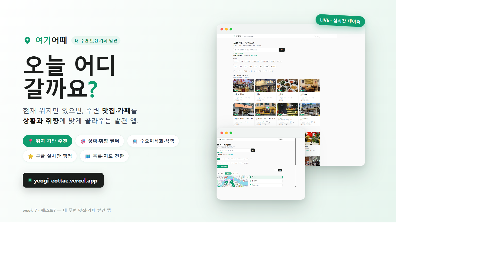

# 여기어때 · 내 주변 맛집·카페 발견

> 내 위치를 기준으로 주변 맛집·카페를 **상황(데이트·혼밥·작업 등)과 취향**에 맞게 찾아주는 웹앱.
> 구글 실시간 평점·영업정보에 **수요미식회·식객 방송 맛집 큐레이션**을 얹어 "지금 어디 갈까?"를 한 화면에서 해결합니다.

🔗 **배포 URL:** https://yeogi-eottae.vercel.app
🎬 **데모 영상:** [`demo.mp4`](./demo.mp4) (약 26초, 모바일 화면) · 📝 **회고:** [`회고.md`](./회고.md) · 🖼 **발표 썸네일:** [`thumbnail.png`](./thumbnail.png)



---

## 한 줄 소개

**"오늘 어디 갈까요?"** — 현재 위치만 있으면 근처 인기 맛집·평점 높은 카페·방송 맛집을 거리순으로 바로 추천받는 앱.

## 주요 기능

- **위치 기반 자동 추천** — GPS(정확한 위치) 또는 IP 기반 대략 위치로 주변 인기 맛집·카페를 가까운 순으로 보여줍니다.
- **상황·취향 필터** — 데이트 · 혼밥 · 가족식사 · 조용한 카페 · 작업하기 좋은 · 가성비 + 음식 종류(한식·일식·중식·양식·고기·카페·디저트·국수분식).
- **지역/지하철역/음식점 검색** — "강남", "연희동", "홍대" 등 인기 지역 바로가기 + 자유 검색.
- **방송 맛집 큐레이션** — 수요미식회·식객 방영 맛집을 별도 데이터로 관리해, 구글 평점 결과와 함께 노출.
- **목록 ↔ 지도 토글** — 결과를 리스트 또는 지도 핀으로 보고, 핀 선택 시 해당 가게로 연동.
- **상세 시트 · 저장(찜) · 공유** — 가게 상세 정보, 관심 장소 저장, 링크 공유.
- **실시간 정보** — 구글 Places(New)로 평점·리뷰수·영업중 여부·주차, 네이버 Directions로 실제 도보/차량 소요시간 계산.

## 기술 구성

| 영역 | 사용 기술 |
|------|-----------|
| 프론트 | 단일 `index.html` (React 18 + Tailwind, CDN, 빌드리스) |
| 백엔드 로직 | `core.js` (로컬 `server.js` · Vercel `api/[...path].js` 공유) |
| 외부 API | Google Places(New), Google Static Maps, Naver Directions |
| 데이터 | `places.json`(방송 맛집 큐레이션), `curated_geo.json`(좌표 캐시) |
| 배포 | Vercel (서버리스 함수 + 정적 호스팅) |

## 로컬 실행

```bash
node server.js
# → http://localhost:8787
```

API 키는 환경변수 우선, 없으면 로컬 `C:\cafe-finder-bot` 폴더의 txt 파일에서 읽습니다.

## 환경변수

| 이름 | 필수 | 설명 |
|------|------|------|
| `GOOGLE_MAPS_KEY` | ✅ | Google Places(New)·Static Maps 키 |
| `NAVER_CLIENT_ID` | 선택 | 네이버 Directions(실시간 소요시간) |
| `NAVER_CLIENT_SECRET` | 선택 | 네이버 Directions |

네이버 키가 없으면 소요시간은 거리 기반 추정치로 대체됩니다.

## 배포 (Vercel)

```bash
vercel --prod
# 최초 1회 환경변수 등록
vercel env add GOOGLE_MAPS_KEY production
vercel env add NAVER_CLIENT_ID production
vercel env add NAVER_CLIENT_SECRET production
```

`vercel.json`이 서버리스 함수(`api/[...path].js`)에 `core.js`·데이터 JSON을 함께 번들하도록 설정되어 있습니다.
